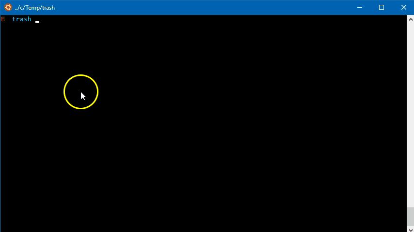

# Un tutorial di base e (spero) molto didattico sull'uso di bash per fare scraping
## Scaricare tutti i bollettini sulla qualità dell'aria del comune di Palermo

Il comune di Palermo pubblica giornalmente in [questo spazio](http://www.rapspa.it/temp/index_file/bollettini_qa/vedi_file.php?mensile=NO&anno=2018) i "**Bollettini sulla qualità dell'aria**": da fine agosto del 2013, ogni giorno un file in formato PDF, quindi un lungo elenco di _hyperlink_, suddiviso in pagine.

Se volessi **scaricare tutti i PDF**, per estrarre ad esempio i dati contenuti all'interno di ognuno, dovrei fare circa **1600 volte _click_** e salva con nome. Mi verrebbe una tendinite alla mano.

Volevo farne il download completo per archiviarli - senza però ammalarmi - e ho scritto poche righe in _bash_ per attivare una procedura di _scraping_ che lo facesse per me.

## Si inizia con l'analisi delle pagine

La prima cosa da fare per progettare una procedura automatica di questo tipo, è guardare un po' le pagine HTML che fanno da sorgente, ed in particolare ad esempio:
- gli URL;
- gli _hyperlink_;
- il codice HTML;
- come è realizzata la suddivisione in pagine.

L'URL di partenza al momento è <br>[http://www.rapspa.it/temp/index_file/bollettini_qa/vedi_file.php?mensile=NO]([http://www.rapspa.it/temp/index_file/bollettini_qa/vedi_file.php?mensile=NO)

È bene sempre fare un po' di click nelle varie sezioni, per capire se ci sono elementi caratterizzanti negli URL. Al click su uno degli anni si vede ad esempio che l'URL cambia in <br>[http://www.rapspa.it/temp/index_file/bollettini_qa/vedi_file.php?mensile=NO&anno=2017](http://www.rapspa.it/temp/index_file/bollettini_qa/vedi_file.php?mensile=NO&anno=2017)

Al cambiare del parametro `anno` nell'URL (`&anno=2017`), viene restituita la prima pagina dell'elenco per quell'anno. È un'informazione importante per definire una procedura automatica di download e la annotiamo.


Se faccio click con il destro su qualcuno dei _link_ ai bollettini giornalieri (in anni diversi), e attivo l'analisi/ispezione del codice, vedo sempre qualcosa come quella di sotto:

```HTML
<a style="color: green; font-weight: bold; " href='#'  
onclick='window.open("bollettino_20171225.pdf","","")'>
Bollettino del 25/12/2017</a>
```
C'è il riferimento al nome del PDF (sopra è `bollettino_20171225.pdf`) e **la struttura dei nomi dei file sembra uguale per tutti gli anni**: `"bollettino_"+"ANNO"+"MESE"+"GIORNO"+".pdf"`. Inoltre il riferimento ai file PDF non è all'interno della proprietà `href` del tag `<a>` (non è un classico **hyperlink**), ma si trova all'interno della proprietà `onclick`.<br>Inoltre non è visibile l'URL completo di download, ma soltanto il nome del file, quindi i PDF si troveranno allo stesso URL che contine le pagine che stiamo vedendo, quindi in `http://www.rapspa.it/temp/index_file/bollettini_qa/`.<br>Anche queste sono informazioni utili per l'automazione del download e le annotiamo.

Infine la **paginazione**. Gli elenchi di bollettini sono a gruppi di 10. Sono sfogliabili con i pulsanti a fondo pagina e si nota che al click non cambia URL. <br>Quindi o i dati sono richiesti al server RAP al click, o sono già presenti nella pagina (anche se non visualizzati). Una prima verifica si può fare con gli strumenti di sviluppo presenti nei _browser_. Se si apre il tab relativo alla rete, qui si nota che al click sui numeri di pagina non c'è alcun traffico di rete (vedi sotto): l'elenco delle pagine è al 99% già presente all'interno delle pagine, sfogliarle è soltanto un modo per visualizzare i dati e non per farne il download.


Se si apre la "vista codice" della [pagina del 2017](http://www.rapspa.it/temp/index_file/bollettini_qa/vedi_file.php?mensile=NO&anno=2017) si vede effettivamente che ci sono i circa 365 bollettini di quell'anno (sotto ad esempio, sono nella prima pagina, ma vedo anche i bollettini seguenti). <br>Anche questa è un'informazione importantissima e la annottiamo.


## La progettazione del download automatico

L'analisi della pagina è preziosa, perché consente di progettare il processo di automazione. Alla luce di quanto visto è necessario creare uno script che:
- apra le pagine di ogni anno;
- da ognuna estragga l'elenco dei bollettini;
- da ogni elemento di questo elenco estragga il nome del PDF;
- per ogni nome di PDF crei l'URL e ne faccia il download.

## Lo script

Lo script che fa il download dei circa 1600 PDF è questo di sotto ed è la traduzione in `bash` di quanto descritto sopra.

```bash
for i in {2013..2018}; \
    do curl "http://www.rapspa.it/temp/index_file/bollettini_qa/vedi_file.php?mensile=NO&anno=$i" | \
    pup '#bollettini > tbody > tr > td:nth-child(2) > a attr{onclick}' | \
    sed -r 's|(window.open\(&#34;)(.*pdf)(.*)|http://www.rapspa.it/temp/index_file/bollettini_qa/\2|g' | \
    xargs wget; 
done
```

Si inizia con un ciclo `for`, perché "per" ogni anno devo ripetere delle istruzioni. Questo un esempio di base

    for i in 2011 2012; do echo "$i"; done

Per ogni elemento nella mia lista (2011 e 2012), che viene associato alla variabile `i`, stampa a video il valore.


Nello script la stringa `{2013..2018}` è una piccola magia di _bash_, che viene trasformata nell'elenco completo degli anni (_brace expansion_), quindi in `for i in 2013 2014 2015 2016 2017 2018`. Comodo!

Per ogni anno viene lanciato `curl` (uno strumento magnifico per "navigare" da riga di comando) e vengono aperte le pagina di ogni anno, tramite l'URL. Nel codice è riportato `&anno=$i`, e nel ciclo `$i` verrà trasformato nel valore dei vari anni.

L'output di `curl` è il codice `HTML` delle varie pagine, che viene passato tramite `pipe` (il carattere `|`, il "tubo") a [**pup**](https://github.com/EricChiang/pup), che è una comodissima _utility_ per estrarre elementi da una pagina web tramite [CSS selectors](https://developer.mozilla.org/en-US/docs/Learn/CSS/Introduction_to_CSS/Selectors). <br>Qui c'è da estrarre il valore dell'attributo `onclick`, presente dentro i tag `<a>`, all'interno della seconda colonna (`<td>`) di ogni riga (`<tr>`), all'interno del corpo della tabella (`<tbody>`) che ha come id `#bollettini`.

In vista codice si vede bene questa gerarchia:


Scritto come CSS Selector è più semplice di come scritto in italinao:

    #bollettini > tbody > tr > td:nth-child(2) > a attr{onclick}`

L'output put per ogni elemento è il valore di `onclick`, qualcosa come `window.open(&#34;bollettino_20180102.pdf&#34;,&#34;&#34;,&#34;&#34;)`. La stringa `&#34;` rappresenta le doppie virgolette (`"`) e c'è da estrarre soltanto `bollettino_20180102.pdf`.<br> Si passa allora l'output di `pup` a `sed` che tramite [**espressioni regolari**](https://github.com/zeeshanu/learn-regex/blob/master/README.md) estrarrà il nome del file PDF. La [regex](https://regex101.com/r/mg3sCJ/1) è:

    (window.open\(&#34;)(.*pdf)(.*)

Vengono creati tre gruppi di stringhe (ogni gruppo, tra parentesi):
- il primo, che contiene `window.open(&#34;`;
- il secondo, tutti i caratteri che seguono (`.*`), sino a `.pdf`;
- il terzo, tutto ciò che segue.

Si vede bene nell'immagine di sotto del comodissimo e didattico [regex101](https://regex101.com/r/mg3sCJ/1).

[](https://regex101.com/r/mg3sCJ/1)

`sed` poi si occuperà di fare il "trova e sostituisci", e dei tre gruppi manterrà solo il secondo (il nome del file, `bollettino_20180102.pdf`), anteponendogli la stringa `http://www.rapspa.it/temp/index_file/bollettini_qa/` in modo da avere l'URL completo di download.

L'output di sed è una lista di URL fattà così:
```
...
http://www.rapspa.it/temp/index_file/bollettini_qa/bollettino_20170108.pdf
http://www.rapspa.it/temp/index_file/bollettini_qa/bollettino_20170107.pdf
http://www.rapspa.it/temp/index_file/bollettini_qa/bollettino_20170106.pdf
http://www.rapspa.it/temp/index_file/bollettini_qa/bollettino_20170105.pdf
http://www.rapspa.it/temp/index_file/bollettini_qa/bollettino_20170104.pdf
...
```
Questa viene passato a `xargs` che passerà il valore di ogni riga a `wget`, che è un'_utility_ che fa il download di dati via web. `xargs` fa "di mestiere" proprio questo: passa una lista di argomenti (qui l'elenco di URL) a un'altra _utility_.

Non resta che aprire la shell, incollare il codice di sopra, dare invio e aspettare che termini il download (**li ho archiviati**, sino a quello del 1 gennaio 2018, [qui](https://github.com/aborruso/bollettiniRAPqualitaAriaPalermo/tree/master/bollettini)).



## Requisiti

Lo script di sopra richiede:

- avere una macchina in cui è possibile lanciare uno script bash (si può ormai su qualsiasi sistema operativo);
- avere installato le _utility_ usate. curl, sed, xargs e wget spesso sono già installate. pup è un eseguibile che va semplicemente [scaricato](https://github.com/EricChiang/pup/releases/tag/v0.4.0) e reso disponibile in una delle cartelle di sistema.

Ci sono ovviamente e soprattutto dei **requisiti di conoscenza**:

- basi di **bash**, [https://learnxinyminutes.com/docs/it-it/bash-it/];
- basi di **CSS selector**, [https://developer.mozilla.org/en-US/docs/Learn/CSS/Introduction_to_CSS/Selectors](https://developer.mozilla.org/en-US/docs/Learn/CSS/Introduction_to_CSS/Selectors);
- basi **espressioni regolari**, [https://github.com/zeeshanu/learn-regex/blob/master/README.md](https://github.com/zeeshanu/learn-regex/blob/master/README.md);
- e basi di HTML e CSS.
